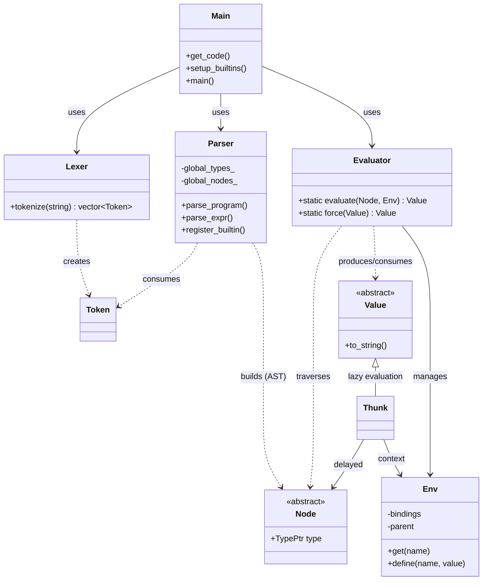
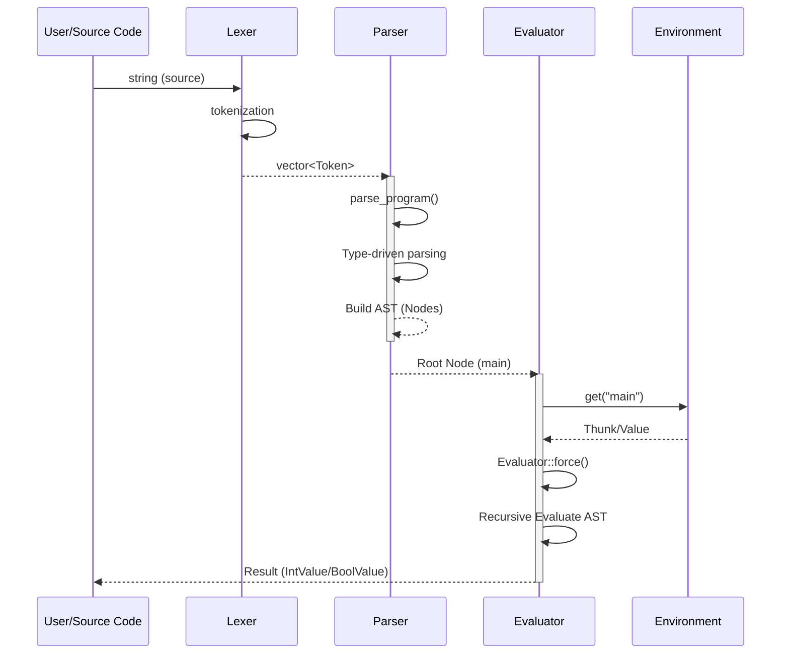

# Zenith Architecture Diagram

この図は、Zenith プログラミング言語インタプリタの全体構成と、ソースコードが実行されるまでの流れを示しています。

## 1. コンポーネント関連図 (Class Diagram)

## 2. 実行フロー (Sequence Diagram)

## 3. 処理の特徴
- **型駆動パース**: Parser は `Type` 情報に基づいて、関数適用 (Application) の結合を決定します。
- **遅延評価 (Lazy Evaluation)**: `Evaluator` は値を必要とするまで `Thunk` として保持し、`force` された際に初めて計算・メモ化します。
- **カリー化**: すべての関数は 1 引数の連鎖 (`Lambda` ノードの入れ子) として表現されます。
